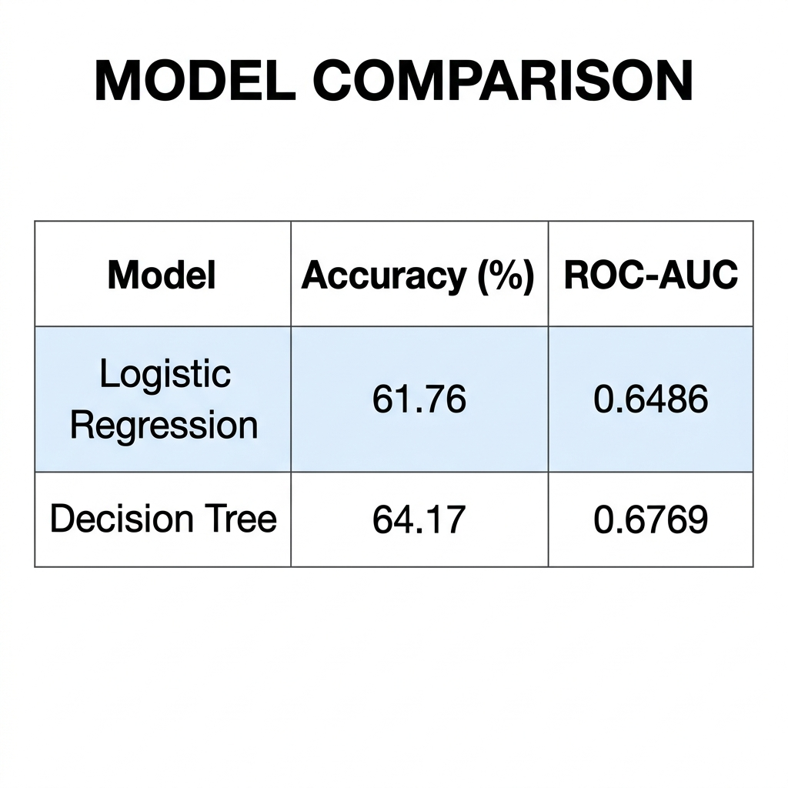
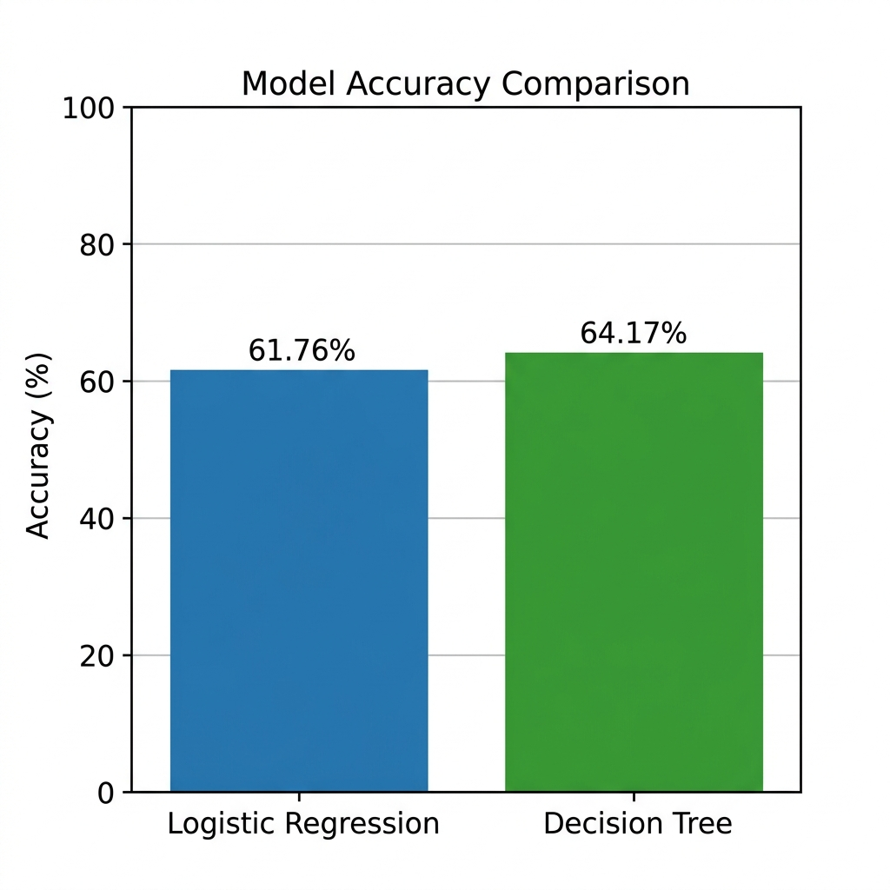

# 🏦 Bank Personal Deposit Prediction

> **Predict whether a bank customer will subscribe to a term deposit** based on customer demographics and previous marketing campaign details using Machine Learning.

---

## 📌 Business Problem

- Identify customers most likely to subscribe to a term deposit
- Reduce marketing costs by targeting the right audience
- Improve overall campaign success rate

**Target Variable:** `deposit` → `yes (1)` / `no (0)`

---

## 📋 Process

### 1️⃣ Data Loading

```python
bank_data = pd.read_csv("bank.csv")
```

- **Dataset:** 11,162 rows × 17 columns
- **Features:** age, job, marital, education, default, balance, housing, loan, contact, day, month, duration, campaign, pdays, previous, poutcome
- **Target:** deposit (yes/no)

---

### 2️⃣ Exploratory Data Analysis (EDA)

| Analysis Type | Visualizations |
|--------------|----------------|
| **Univariate** | Age Distribution, Balance Distribution, Job Count, Education Count, Deposit Count |
| **Bivariate** | Age vs Deposit, Balance vs Deposit, Job vs Deposit, Education vs Deposit, Housing vs Deposit, Loan vs Deposit, Marital vs Deposit |
| **Multivariate** | Age vs Balance vs Deposit, Job + Education + Deposit, Correlation Heatmap, Pair Plot |

---

### 3️⃣ Data Cleaning

- ✅ Checked for **null values** → None found
- ✅ Checked for **duplicate rows** → None found

---

### 4️⃣ Feature Selection

Dropped columns that cause **data leakage** or are not useful for prediction:

```python
bank_data.drop(
    columns=["contact", "day", "month", "duration",
             "campaign", "pdays", "previous", "poutcome"],
    inplace=True
)
```

> ⚠️ `duration` is dropped because it is only known **after** the call ends — including it would cause data leakage.

---

### 5️⃣ Feature Engineering

```python
# Encode target variable
bank_data["deposit"] = bank_data["deposit"].map({"yes": 1, "no": 0})

# One-Hot Encoding for categorical columns
bank_data = pd.get_dummies(
    bank_data,
    columns=["job", "marital", "education", "default", "housing", "loan"]
)
```

---

### 6️⃣ Define Features & Train-Test Split

```python
X = bank_data.drop("deposit", axis=1)
y = bank_data["deposit"]

X_train, X_test, y_train, y_test = train_test_split(
    X, y, test_size=0.2, random_state=42, stratify=y
)
```

---

### 7️⃣ Model 1 — Logistic Regression

```python
# Feature Scaling (required for Logistic Regression)
scaler = StandardScaler()
X_train = scaler.fit_transform(X_train)
X_test = scaler.transform(X_test)

# Build & Train
model = LogisticRegression(random_state=42)
model.fit(X_train, y_train)
```

**Evaluation:**
- Accuracy, Confusion Matrix, Classification Report
- ROC-AUC Score & ROC Curve
- Cross Validation (5-Fold)
- Feature Importance (Coefficients)
- Model saved as `bank_deposit_model.pkl`

---

### 8️⃣ Model 2 — Decision Tree

```python
# Fresh split with UNSCALED data (Decision Trees don't need scaling)
X_train_dt, X_test_dt, y_train_dt, y_test_dt = train_test_split(
    X, y, test_size=0.2, random_state=42, stratify=y
)

# Hyperparameter Tuning with GridSearchCV
param_grid = {
    "criterion": ["gini", "entropy"],
    "max_depth": [5, 8, 10, 15, 20, None],
    "min_samples_split": [2, 5, 10],
    "min_samples_leaf": [1, 2, 4]
}

grid_dt = GridSearchCV(dt_model, param_grid, cv=5, scoring="accuracy", n_jobs=-1)
grid_dt.fit(X_train_dt, y_train_dt)
```

**Evaluation:**
- Accuracy, Confusion Matrix (Heatmap), Classification Report
- ROC-AUC Score & ROC Curve
- Feature Importance (Bar Chart — Top 15 Features)
- Decision Tree Visualization (`plot_tree` + `export_text`)
- Cross Validation (5-Fold)
- Model saved as `decision_tree_model.pkl`

---

### 9️⃣ Model Comparison





| Model | Accuracy (%) | ROC-AUC |
|-------|:------------:|:-------:|
| Logistic Regression | 61.76 | 0.6486 |
| **Decision Tree** | **64.17** | **0.6769** |

> 📝 **Note:** Accuracy is lower than typical benchmarks (~80-90%) because `duration` was intentionally dropped to avoid data leakage. This gives a **realistic, production-ready** model.

---

## 🛠️ Tech Stack

| Tool | Purpose |
|------|---------|
| **Python** | Programming Language |
| **Pandas** | Data Manipulation |
| **Matplotlib & Seaborn** | Data Visualization |
| **Scikit-learn** | ML Models, Preprocessing, Evaluation |
| **Joblib** | Model Serialization |

---

## 📁 Project Structure

```
Bank Personal Loan Prediction/
├── bank.csv                            # Dataset
├── Bank Personal Deposit Prediction.ipynb  # Main Notebook
├── bank_deposit_model.pkl              # Saved Logistic Regression Model
├── decision_tree_model.pkl             # Saved Decision Tree Model
├── scaler.pkl                          # Saved StandardScaler
├── model_comparison_results.png        # Model Comparison Table
├── accuracy_bar_chart.png              # Accuracy Comparison Chart
└── README.md                           # This File
```

---

## 🚀 How to Run

1. Clone this repository
2. Open `Bank Personal Deposit Prediction.ipynb` in Jupyter Notebook
3. Run all cells from top to bottom
4. View model comparison results at the end

---
